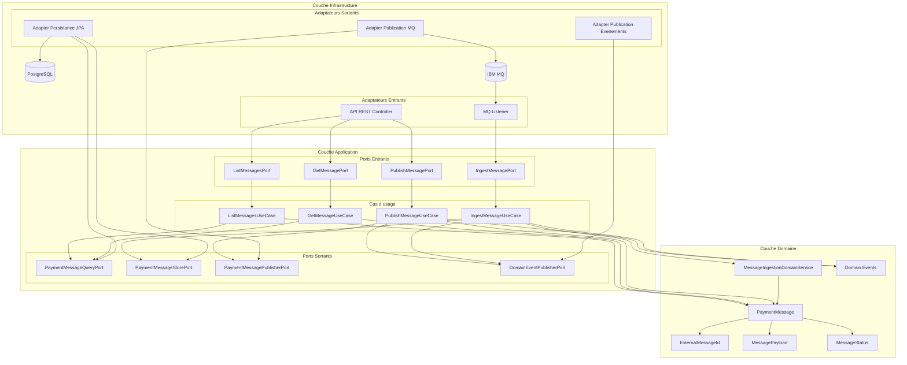
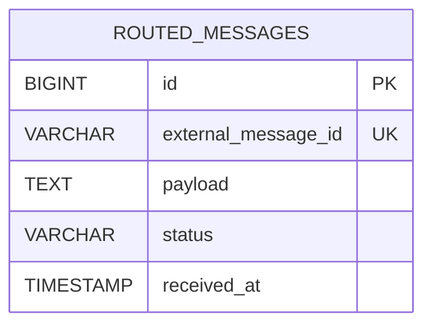

# Backend Routage des Paiements

## Stack Technologique

- Java 21+
- Spring Boot
- Spring Web
- Spring Data JPA
- Spring JMS
- Client IBM MQ Jakarta
- Maven + JaCoCo
- JUnit 5 + Mockito

## Architecture

### Approche : Architecture Hexagonale (Ports et Adaptateurs)

Cette application suit une **architecture hexagonale** (aussi appelée ports et adaptateurs) qui organise le code en trois couches concentriques :

1. **Cœur du Domaine** (au centre) : contient la logique métier pure, indépendante de tout framework
2. **Couche Application** (anneau intermédiaire) : définit les **ports** (interfaces d'abstraction) et les cas d'usage
3. **Infrastructure** (anneau externe) : implémente les **adaptateurs** qui connectent le domaine aux systèmes externes (MQ, BDD, API, etc.)

**Avantages** :
- ✅ Testabilité : le domaine ne dépend d'aucun framework
- ✅ Flexibilité : remplacer MQ par Kafka, JDBC par JPA, sans toucher au domaine
- ✅ Maintenabilité : les responsabilités sont clairement séparées
- ✅ Indépendance de la technologie : l'implémentation technique est isolée

### Ports et Adaptateurs

Les **ports** sont des interfaces définies dans la couche application.
On distingue :

- **Ports entrants (input ports)** : contrats exposés par les cas d'usage
- **Ports sortants (output ports)** : contrats requis par les cas d'usage vers l'infrastructure

Ports entrants :

| Port | Responsabilité | Implémentation |
|------|----------------|----------------|
| `IngestMessagePort` | Point d'entrée applicatif pour l'ingestion | `IngestMessageUseCase` |
| `ListMessagesPort` | Point d'entrée applicatif pour la liste | `ListMessagesUseCase` |
| `GetMessagePort` | Point d'entrée applicatif pour la consultation | `GetMessageUseCase` |
| `PublishMessagePort` | Point d'entrée applicatif pour la publication | `PublishMessageUseCase` |

Ports sortants :

| Port | Responsabilité | Adaptateurs |
|------|----------------|-------------|
| `PaymentMessageQueryPort` | Requêtes en lecture | `JpaPaymentMessageQueryAdapter` |
| `PaymentMessageStorePort` | Persistance en écriture | `JpaPaymentMessageStoreAdapter` |
| `PaymentMessagePublisherPort` | Publication MQ | `MqPaymentMessagePublisherAdapter` |
| `DomainEventPublisherPort` | Publication d'événements domaine | `SpringDomainEventPublisherAdapter` |

Les **adaptateurs** sont les implémentations techniques dans l'infrastructure :
- Adaptateur JPA pour la persistance → utilise Spring Data JPA + Hibernate
- Adaptateur MQ pour la publication → utilise IBM MQ Jakarta client
- Adaptateur Spring pour les événements domaine → utilise Spring Events

**Bénéfice** : Si demain on change MQ pour Kafka, on crée un nouvel adaptateur sans modifier le cœur métier.

### Diagramme Architecture

## Responsabilités des Couches

### Domaine

Contient les règles métier et les invariants :
- agrégat : `PaymentMessage`
- objets de valeur : `ExternalMessageId`, `MessagePayload`
- modèle d'état : `MessageStatus`
- service de domaine : `MessageIngestionDomainService`
- événements de domaine : `MessageReceivedEvent`, `MessagePublishedEvent`

Aucun couplage avec les frameworks Spring/JPA/MQ ne doit s'y infiltrer.

### Application

Contient les cas d'usage et les contrats de ports :
- cas d'usage : ingestion, publication, liste, consultation
- ports entrants : `IngestMessagePort`, `ListMessagesPort`, `GetMessagePort`, `PublishMessagePort`
- ports sortants : `PaymentMessageQueryPort`, `PaymentMessageStorePort`, `PaymentMessagePublisherPort`, `DomainEventPublisherPort`
- mappage du domaine vers le modèle applicatif (`PaymentMessageRecord` via `MessageRecordMapper`)
- exception applicative (`MessageNotFoundException`)

### Infrastructure

Contient les implémentations techniques :
- contrôleurs API et gestionnaires d'exceptions
- adaptateur listener MQ et adaptateur producer MQ
- entité persistance/référentiel/service/mappage
- adaptateurs implémentant les ports applicatifs
- chargeur de données de bootstrap

## Modèle

