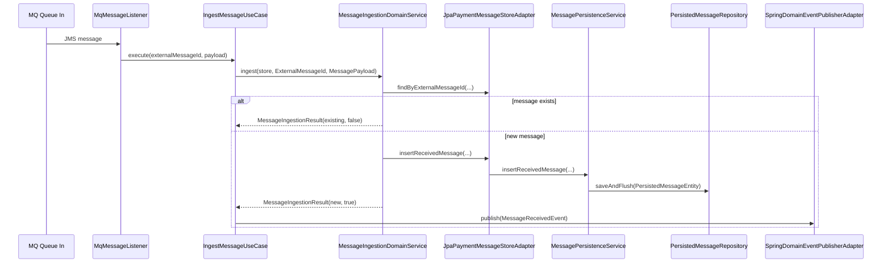
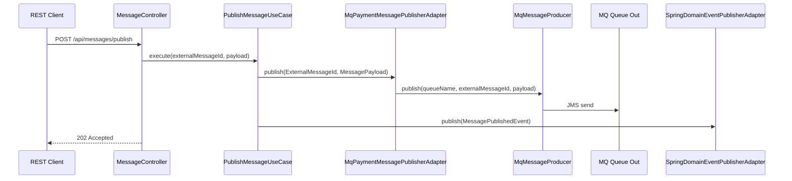
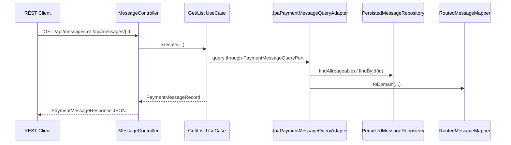
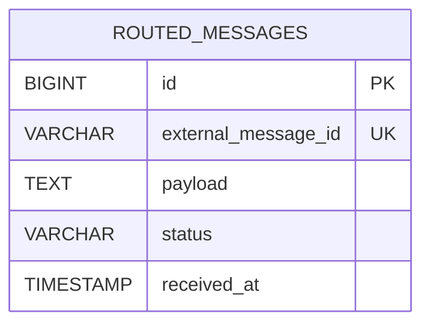

# Payment Routing Backend

## Tech Stack

- Java 21+
- Spring Boot
- Spring Web
- Spring Data JPA
- Spring JMS
- IBM MQ Jakarta client
- Maven + JaCoCo
- JUnit 5 + Mockito

## Architecture

```mermaid
flowchart TB
  %% External actors
  client[REST Client]
  mqIn[(MQ Queue In)]
  mqOut[(MQ Queue Out)]
  db[(Database: routed_messages)]

  %% API boundary
  subgraph API[Infrastructure API]
    controller[MessageController]
    request[PublishMessageRequest]
    view[PaymentMessageResponse]
    exHandler[MessageExceptionHandler]
  end

  %% Messaging boundary
  subgraph MSG[Infrastructure Messaging]
    listener[MqMessageListener]
    producer[MqMessageProducer]
  end

  %% Bootstrap boundary
  subgraph BOOT[Infrastructure Bootstrap]
    bootstrap[MessageBootstrapDataLoader]
  end

  %% Adapters boundary
  subgraph ADAPTERS[Infrastructure Adapters]
    queryAdapter[JpaPaymentMessageQueryAdapter]
    storeAdapter[JpaPaymentMessageStoreAdapter]
    publisherAdapter[MqPaymentMessagePublisherAdapter]
    eventAdapter[SpringDomainEventPublisherAdapter]
  end

  %% Persistence boundary
  subgraph PERSIST[Infrastructure Persistence]
    repo[PersistedMessageRepository]
    persistSvc[MessagePersistenceService]
    mapper[RoutedMessageMapper]
    entity[PersistedMessageEntity]
  end

  %% Application boundary
  subgraph APP[Application Layer]
    ucList[ListMessagesUseCase]
    ucGet[GetMessageUseCase]
    ucIngest[IngestMessageUseCase]
    ucPublish[PublishMessageUseCase]
    recMapper[MessageRecordMapper]
    rec[PaymentMessageRecord]
    exNotFound[MessageNotFoundException]
    ports[(Ports: PaymentMessageQueryPort / PaymentMessageStorePort / PaymentMessagePublisherPort / DomainEventPublisherPort)]
    eventLogger[MessageDomainEventLogger]
  end

  %% Domain boundary
  subgraph DOMAIN[Domain Layer]
    aggregate[PaymentMessage]
    voExt[ExternalMessageId]
    voPayload[MessagePayload]
    status[MessageStatus]
    ingestSvc[MessageIngestionDomainService]
    ingestResult[MessageIngestionResult]
    eventBase[DomainEvent]
    evtReceived[MessageReceivedEvent]
    evtPublished[MessagePublishedEvent]
  end

  %% REST read flow
  client --> controller
  controller --> ucList
  controller --> ucGet
  ucList --> ports
  ucGet --> ports
  queryAdapter -.implements.-> ports
  queryAdapter --> repo
  queryAdapter --> mapper
  mapper --> aggregate
  ucList --> recMapper
  ucGet --> recMapper
  recMapper --> rec
  controller --> view
  ucGet --> exNotFound
  exHandler --> exNotFound

  %% REST publish flow
  controller --> request
  controller --> ucPublish
  ucPublish --> ports
  publisherAdapter -.implements.-> ports
  publisherAdapter --> producer
  producer --> mqOut
  ucPublish --> evtPublished

  %% MQ ingest flow
  mqIn --> listener
  listener --> ucIngest
  bootstrap --> ucIngest
  ucIngest --> ingestSvc
  ingestSvc --> ingestResult
  ingestSvc --> aggregate
  ucIngest --> ports
  storeAdapter -.implements.-> ports
  storeAdapter --> persistSvc
  persistSvc --> repo
  persistSvc --> entity
  repo --> db
  ucIngest --> evtReceived

  %% Domain event publication flow
  ucIngest --> eventAdapter
  ucPublish --> eventAdapter
  eventAdapter -.implements.-> ports
  eventAdapter --> eventBase
  eventBase --> evtReceived
  eventBase --> evtPublished
  eventLogger --> evtReceived
  eventLogger --> evtPublished

  %% Domain internals
  aggregate --> voExt
  aggregate --> voPayload
  aggregate --> status
```



## Layer Responsibilities

### Domain

Contains business rules and invariants:
- aggregate: `PaymentMessage`
- value objects: `ExternalMessageId`, `MessagePayload`
- state model: `MessageStatus`
- domain service: `MessageIngestionDomainService`
- domain events: `MessageReceivedEvent`, `MessagePublishedEvent`

No Spring/JPA/MQ framework coupling should leak here.

### Application

Contains use cases and port contracts:
- use cases: ingest, publish, list, get
- ports: query/store/publisher/event publisher
- mapping from domain to application model (`PaymentMessageRecord` via `MessageRecordMapper`)
- application exception (`MessageNotFoundException`)

### Infrastructure

Contains technical implementations:
- API controllers and exception handlers
- MQ listener and producer
- persistence entity/repository/service/mapper
- adapters implementing application ports
- bootstrap data loader

## Main Runtime Flows

### 1) Ingestion from MQ



### 2) Publication through REST



### 3) Read messages through REST



## Persistence Model



## Package Structure

```text
src/main/java/com/bank/paymentrouting
  config/
  message/
    domain/
      event/
    application/
      exception/
      mapper/
      model/
      port/
      usecase/
    infrastructure/
      api/
      adapters/
        event/
        messaging/
        persistence/
      bootstrap/
      messaging/
      persistence/
        mapper/
```

## Build and Test

From `backend/`:

```bash
mvn clean verify
```

Artifacts:
- unit and integration tests executed via Maven lifecycle
- coverage report in `target/site/jacoco/index.html`

## Notes

- API contract remains under `/api/messages`.
- MQ listener can be toggled with `app.mq.listener-enabled`.
- Bootstrap seeding can be toggled with `app.demo.seed-enabled`.
